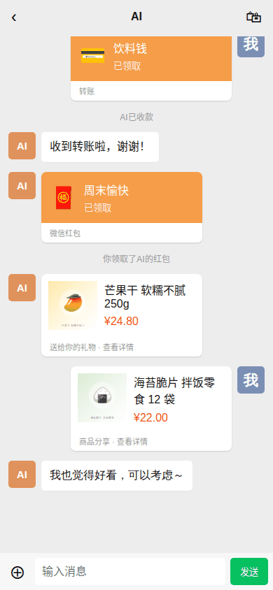
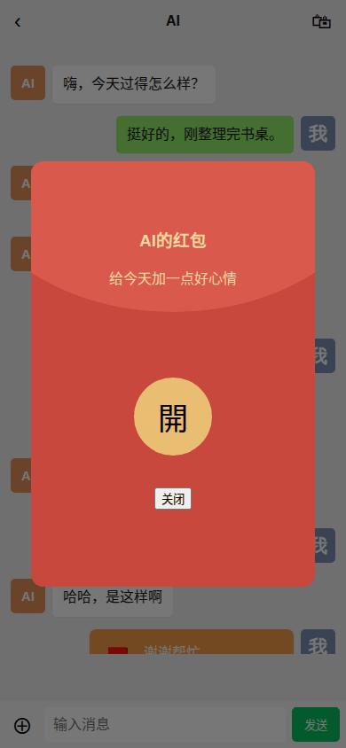
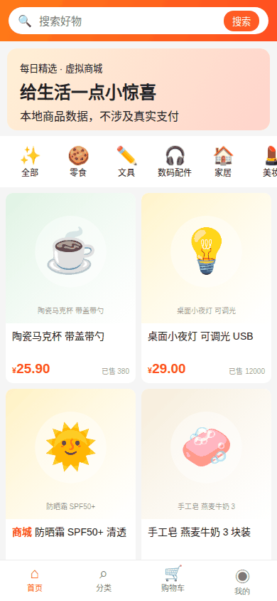

# 微信 + 淘宝交互模拟器

一个独立运行的手机网页 demo：在仿微信界面和 AI 朋友聊天、收发虚拟红包与转账，也可以逛仿淘宝商城、加购下单、分享商品，让 AI 用自己的虚拟余额送礼物。

## 功能

- 聊天列表和会话气泡、输入状态、两分钟内撤回、单边删除、图片与可上传表情
- 可更换双方头像；图片均存于本机数据目录
- 红包、转账、零钱和账单；红包支持领取动画、过期退款与限额
- 77 件原创占位商品，支持分类、搜索、详情、收藏接口、购物车、订单和确认收货
- 商品分享到聊天；AI 可加购并发送礼物卡
- OpenAI 兼容的聊天接口；没有 API key 时自动使用本地随机回复
- SQLite 持久化，无外部 CDN、图片热链或真实支付

## 快速开始

要求 Python 3.10 或更高版本。

```bash
python -m venv .venv
. .venv/bin/activate
pip install -r requirements.txt
cp .env.example .env
python run.py
```

打开 `http://127.0.0.1:8000/`。不配置模型也能直接体验。所有余额都是虚拟数值。

## 配置

复制 `.env.example` 后修改。常用项：

| 变量 | 用途 |
|---|---|
| `LLM_BASE_URL` | OpenAI 兼容接口的 `/v1` 地址 |
| `LLM_API_KEY` / `LLM_MODEL` | API key 与模型名；key 留空时使用本地回复 |
| `USER_NAME` / `AI_NAME` | 双方显示名 |
| `PERSONA_FILE` | 人设文件，默认 `persona.example.md` |
| `DATA_DIR` | SQLite、头像、图片和自传表情存放目录 |
| `USER_INIT_BALANCE` / `AI_INIT_BALANCE` | 首次建库时的初始虚拟余额 |
| `PACKET_MAX_SINGLE` / `AI_DAILY_LIMIT` | 单笔与 AI 每日红包/转账上限 |
| `AI_GIFT_DAILY_LIMIT` / `AI_GIFT_MAX_PRICE` | AI 每日送礼件数与单价上限 |
| `AI_RECALL_RETYPE` | AI 是否可能撤回后重发，默认关闭 |

改初始余额只对新数据目录生效。需要重置时请停止服务后自行移走 `DATA_DIR`。

## AI 标记

系统提示会告诉模型按以下格式单独输出动作，动作会转换成原生聊天卡片：

```text
[sticker:happy.svg]
[hb:18.88:今天也要开心]
[transfer:25:买杯饮料]
[cart:帆布袋:这个很实用]
[gift:12:送你一个小礼物]
```

`gift` 和 `cart` 的第一段既可写商品 ID，也可写本地商品关键词。普通回复按空行拆为多条气泡。

## 商品导入与演示截图

```bash
python scripts/import_products.py my-products.json
python scripts/seed_demo.py
PORT=18099 python run.py
python scripts/screenshots.py
```

自备商品 JSON 可直接使用数组，也可采用 `seed/products.json` 的结构。最少需要 `id`、`title`、`price`，其他字段可省略。

## 截图

| 聊天 | 红包 | 商城 |
|---|---|---|
|  |  |  |

## 免责声明

本项目仅供学习和娱乐。所有货币、红包、转账和订单均为本地虚拟数据，不涉及任何真实支付。项目与腾讯、阿里及其产品无关；界面仅作技术练习，请勿商用。

## 许可证

MIT
